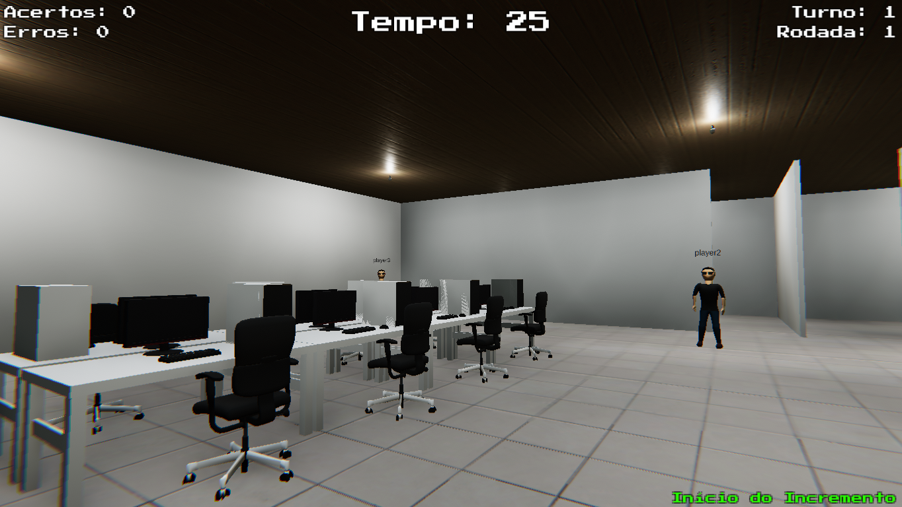

# Scrum XPerience

<!---Esses são exemplos. Veja https://shields.io para outras pessoas ou para personalizar este conjunto de escudos. Você pode querer incluir dependências, status do projeto e informações de licença aqui--->

> Jogo educativo voltado para o ensino das metodologias ágeis Scrum e eXtreme Programming. Para isso, foi utilizado Unity, juntamente com a linguagem C#.

### Ajustes e melhorias

O projeto ainda está em desenvolvimento e as próximas atualizações serão voltadas nas seguintes tarefas:

* Correções no multiplayer
* Níveis de dificuldade
* Escolhas em grupo
* Adição de cenários e metodologias
* Adição de recursos sonoros
* Novos idiomas

## 💻 Pré-requisitos

Antes de começar, verifique se você atendeu aos seguintes requisitos:
<!---Estes são apenas requisitos de exemplo. Adicionar, duplicar ou remover conforme necessário--->
* Você possui o software Unity instalado na versão `2020.3.0.0f1 ou superior`
* Você tem uma máquina `Windows (10 ou superior) / Linux / Mac`. Obs.: Para melhor performance, utilize Windows

## 🚀 Instalando o Scrum XPerience

Para instalar o Scrum XPerience, basta baixar o código e adicioná-lo ao Unity HUB. Com a versão correta do software, você poderá abrir o projeto sem problemas.

## ☕ Usando o Scrum XPerience

Para usar Scrum XPerience, siga estas etapas:

1. Abra o software com o Unity
2. Acesse a aba `File` e clique em `Build and Run`

Pronto! Você já está rodando a aplicação. Você também pode obtê-la [aqui](https://www.dcce.ibilce.unesp.br/sxp).

[⬆ Voltar ao topo](#scrum-xperience) 
